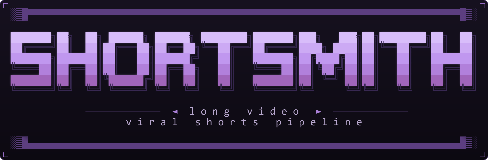

<!-- shortsmith-ansi-logo -->
<div align="center">

</div>

# shortsmith

**Long-form video in. Batch of viral 9:16 captioned-with-b-roll-with-SFX shorts out.**

Local-first pipeline that turns a multi-hour podcast or livestream into a folder
of polished short-form clips — face-tracked vertical, filler-free, audio-enhanced
to broadcast loudness, word-aligned karaoke captions, AI-selected b-roll, and a
curated sound-effect overlay. End-to-end, your machine. Three command sequence
from raw mp4 to publish-ready folder.

```
your-video.mp4 (3hr podcast, talking-head)
       │
       │ ┌─── PHASE A: pick + cut + clean clips ───┐
       ├─┤ 1. Transcribe (faster-whisper)          │
       │ │ 2. Find evergreen viral clips (Claude or Ollama) │
       │ │ 3. Cut + reorder for hook-first delivery │
       │ │ 4. Remove silences, fillers, stutters   │
       │ └────────────────────────────────────────┘
       │ ┌─── PHASE B: audio + alignment + face ───┐
       ├─┤ 5. Enhance speech (ClearerVoice MossFormer2_SE_48K) │
       │ │    + two-pass loudnorm to -14 LUFS       │
       │ │ 6. Force-align words (WhisperX wav2vec2, ~20ms) │
       │ │ 7. Reframe 9:16 (YuNet biggest-face)     │
       │ └────────────────────────────────────────┘
       │ ┌─── PHASE C: render + caption + b-roll + VFX + SFX ───┐
       ├─┤ 8. Scaffold Hyperframes project          │
       │ │ 9. Hyperframes base render (slam hook + callouts) │
       │ │ 10. Remotion layer (captions + AI b-roll + Glare/Flash/ZoomPunch) │
       │ │ 11. SFX overlay (swipe-in / cash / ding / error-buzz) │
       │ └────────────────────────────────────────┘
       ↓
  hyperframes-student-kit/renders/_all/
    <source>__short-01-<hook>.mp4    (publish-ready 1080×1920)
    <source>__short-01-<hook>.txt    (paste-ready Instagram caption)
    <source>__short-02-<hook>.mp4
    ...
```

## Quick start

```bash
git clone --recurse-submodules https://github.com/highbaud/shortsmith
cd shortsmith
./setup.sh                                  # or .\setup.ps1 on Windows
# edit .env to add your ANTHROPIC_API_KEY (or pick --clip-engine ollama)
uv run shortsmith run path/to/your-video.mp4
uv run python scripts/finalize.py           # captions + b-roll + SFX + consolidate
```

Forgot `--recurse-submodules`? Run `git submodule update --init --recursive`.

## Requirements

- **Python 3.12** (managed by [`uv`](https://docs.astral.sh/uv/))
- **ffmpeg** on PATH
- **NVIDIA GPU strongly recommended** (Whisper + ClearerVoice + WhisperX all prefer CUDA)
- **Node 22+** for Hyperframes render + Remotion captions layer (Hyperframes requires 22+)
- **Anthropic API key** for clip selection (or run Ollama locally for free)
- **Sibling uv projects** for the heavy lifters — `audio-enhance/`, `whisperx-align/` (Python 3.10/3.11 each), set up by `setup.sh`

See [docs/SETUP.md](docs/SETUP.md) for per-OS install, CUDA torch matrix, model download sizes, and what `setup.sh` actually does.

## Cost note (clip selection)

Step 2 calls an LLM once per source video with the full transcript:

| Source length | Approx. cost (Claude Opus 4) | Free alternative |
|---|---|---|
| 30 min | $0.10 | Ollama llama3.1:70b |
| 1 hr | $0.20 | LM Studio + any 70B |
| 2 hr | $0.50 | vLLM + any OpenAI-compatible |
| 3 hr | $0.80 | Hand-write `clips.json`, run `--from-step 3` |

Switch backends with `--clip-engine ollama` or `SHORTSMITH_CLIP_ENGINE=ollama`. The rubric is at [`prompts/find_viral_clips.md`](prompts/find_viral_clips.md) — edit it for your content.

## The 11-phase pipeline (what each step does)

**1. Transcribe** — faster-whisper large-v3 on GPU, word-level timestamps. Reuses a sibling `transcript-<stem>.json` if present. Whisper is prompted with a glossary of the names and terms this channel uses (`shortsmith/names.py`), and the mishearings that survive ("Sailor" for Saylor, "Larson" for Larsen) are respelled before anything downstream reads the words, so captions never show them.

**2. Find viral clips** — Claude (or local LLM) reads the transcript and returns a `clips.json` with `viral_score`, `hook_text`, `callouts`, `instagram_caption`, and a `segments` list that can reorder a clip to lead with the hook.

**3. Cut + reorder** — ffmpeg cuts with tiered boundary snap (sentence-end → breath → any-gap). `prefer_after=True` on the end-of-clip snap so we extend forward to a clean sentence end instead of chopping a thought. 80 ms xfade at every reorder seam.

**4. Clean** — word-aware. Removes fillers (only pure stammers + "you know" by default; "like" / "basically" / "literally" left alone), collapses adjacent stutters (e.g. `I-I-I think` → `I think`), and trims silences > 0.8s. Cuts never land inside a word.

**5. Enhance audio** — ClearerVoice MossFormer2_SE_48K in a sibling uv venv. Two-pass ffmpeg `loudnorm` to **-14 LUFS** (TikTok / Instagram / YouTube short-form playback standard).

**6. Force-align** — WhisperX wav2vec2 re-aligns word boundaries to ~20 ms in a sibling uv venv (CUDA). Falls back to in-process faster-whisper retranscribe if WhisperX isn't installed.

**7. Reframe 9:16** — YuNet face detection. Biggest-face-wins filter (rejects PIP cameras + chat avatars on 4K source). IQR outlier rejection, EMA smoothing, single static crop per clip. Face center at 40% from top, occupies ~32% of vertical.

**8. Scaffold** — Self-contained Hyperframes project per clip. Slam hook (opening 2.6s), accent callouts (`caption` / `punch` / `bigstat` / `hero`), ambient bg with vignette + grain. Visual style driven by [one of three preset `style.json` files](templates/styles/).

**9. Hyperframes render** — `npx hyperframes render` produces the base mp4 with slam hook + callouts + Ken Burns on the face cam.

**10. Remotion layer.** `scripts/apply_remotion.py` overlays word-level karaoke captions on top of the base render, plus AI-selected b-roll: a logo when a brand is named, a photo when a person is named. Every asset is **identity-verified against Wikidata before it can appear** (see below). Output: `final_remotion.mp4`.

**11. SFX overlay** — `scripts/add_sfx.py` mixes a curated SFX pack onto the speech. Structural triggers (hook impact at t=0, swipe-in on callouts) + semantic triggers (cash register on first money word, ding on bigstat numbers). Levels approved: peaks at -9 dBFS, sits ~10–16 dB under voice, limiter at the end. Output: `final_sfx.mp4`.

**Consolidation** — `scripts/finalize.py` runs all three render phases and copies `final_sfx.mp4` + matching `caption.txt` into `<kit>/renders/_all/<source>__<short>.{mp4,txt}` with a flat naming scheme. Idempotent — safe to re-run.

A short re-renders only when something it depends on changed. `scripts/render_stamp.py` records a digest of every input beside each render (the base video, the clip spec, the words, the manual b-roll list, the photo state of every person the words name, the render code, and the style / platform / captions switches), and `apply_remotion` compares it before rendering again. A short rendered before stamps existed keeps the old rule (newer than its base render) until `--force-remotion` rebuilds it, so an unscoped finalize never rebuilds the whole library by surprise; the phase summary says how many such shorts it left alone.

## Configuration

All paths and tunables override via env vars or a project-local `.env` (auto-loaded). See [`.env.example`](.env.example) for the full surface. High-traffic knobs:

| Env var | Default | Purpose |
|---|---|---|
| `ANTHROPIC_API_KEY` | (required for anthropic engine) | Claude API key |
| `SHORTSMITH_CLIP_ENGINE` | `anthropic` | `anthropic` (Claude API) / `ollama` (local LLM) |
| `SHORTSMITH_STYLE` | `xrp-revolution` | `xrp-revolution` / `minimal` / `bold` |
| `SHORTSMITH_ENHANCE` | `clearvoice` | Audio enhancement engine |
| `SHORTSMITH_ALIGN` | `whisperx` | Word alignment (`whisperx` / `faster-whisper`) |
| `SHORTSMITH_LUFS` | `-14.0` | Loudness normalization target |
| `SHORTSMITH_SFX_SEMANTIC` | `sparing` | SFX mode: `sparing` / `every` / `off` |
| `SHORTSMITH_WHISPER_MODEL` | `large-v3` | `small` / `medium` / `large-v3` |
| `SHORTSMITH_MIN_SCORE` | `7` | Reject clips below this viral score (1–10) |
| `SHORTSMITH_HYPERFRAMES_VERSION` | `0.7.71` | Pinned Hyperframes CLI. `latest` floats off the pin |
| `SHORTSMITH_WHISPER_PROMPT` | glossary from `shortsmith/names.py` | Names and terms Whisper must spell right. Set empty to send no prompt |

## Common operations

```bash
# Smoke test (no API key, no GPU required)
uv run python scripts/smoke_test.py

# Full pipeline on a single video, all 11 phases
uv run shortsmith run path/to/video.mp4
uv run python scripts/finalize.py

# Cap clips for a fast first run
uv run shortsmith run path/to/video.mp4 --max-clips 3

# Resume from a specific step (uses on-disk artifacts from previous steps)
uv run shortsmith run path/to/video.mp4 --from-step 5

# Skip audio enhancement (faster iteration loop)
uv run shortsmith run path/to/video.mp4 --no-enhance

# Free clip selection via local LLM
uv run shortsmith run path/to/video.mp4 --clip-engine ollama

# Different visual style
uv run shortsmith run path/to/video.mp4 --style minimal

# Multicam / two-speaker source (podcast cut between two cameras)
uv run shortsmith run path/to/video.mp4 --cut-aware

# Re-process every existing work dir with the latest pipeline
uv run python scripts/reprocess_all.py

# Finalize (Remotion captions + SFX + consolidate) for specific sources only
uv run python scripts/finalize.py --slug <source-slug> [--slug <source-slug> ...]

# Check what every curated person / brand resolves to before rendering
uv run python scripts/gen_broll.py --audit-people
uv run python scripts/gen_broll.py --audit-brands
```

For batch operations across many source videos, see [`scripts/batch_pipeline.py`](scripts/batch_pipeline.py) and [`scripts/reprocess_all.py`](scripts/reprocess_all.py).

## Multicam / two-speaker sources

The default reframe computes ONE static 9:16 crop per clip from the speaker's
median face position — perfect for a single talking head, wrong for a podcast
that hard-cuts between two cameras (the crop would average both speakers'
positions and frame neither).

`--cut-aware` (or `SHORTSMITH_REFRAME_CUTAWARE=on`, or per-clip
`"multicam": true` in `clips.json`) switches reframe to cut-aware mode:

1. detect the camera cuts with ffmpeg scene detection
   (`SHORTSMITH_SCENE_THRESHOLD`, default 0.30),
2. compute an independent face crop for each shot with the same robust
   median/IQR logic as the static path,
3. stitch the shots with one `filter_complex` — video segmented per shot, audio
   left as a single untouched stream, so A/V never drifts.

No diarization needed: the edit already did the speaker-switching; reframe just
follows whoever is on screen in each shot. Clips with no detected cuts fall
back to the static crop automatically, so mixed batches are fine.

Related per-clip flag: `"captions": false` in `clips.json` makes the finalize
pass skip shortsmith's caption layer for that clip — use it when the source has
its own burned-in captions (common on podcast exports).

## Gallery view / both speakers on screen at once (split-stack)

Cut-aware mode handles a podcast that *cuts between* two cameras. It cannot help
when both speakers are on screen **at the same time**: a Zoom / Riverside /
StreamYard "gallery view" export, where the layout never changes for the whole
recording. There are no cuts to find, and a single crop frames one speaker while
losing the other.

`--layout split-stack` (or `SHORTSMITH_REFRAME_LAYOUT=split-stack`, or per-clip
`"layout": "split-stack"` in `clips.json`) treats the source as what it actually
is, two camera feeds sharing one frame:

1. detect the two webcam tiles from the frame's bright regions,
2. track each speaker's face **inside their own tile**, so the two can never be
   confused for one another,
3. crop a square around each and stack them, first speaker top, second bottom,
   over a blurred backdrop, with a gold hairline around each square,
4. reserve the gap between the squares as the caption band, so captions sit dead
   center screen and cross neither face.

`--layout auto` uses the stacked layout only when a two-up gallery is actually
detected, and falls back to the normal crop otherwise, so mixed batches are fine.

**Head sizes are normalized.** Speakers rarely sit the same distance from their
webcams (in testing one speaker's face measured 540px against the other's 325px).
Each square is sized so both faces fill the same fraction of their panel,
otherwise stacking them makes the mismatch glaring.

**One audio stream, by construction.** The two panels are two crops of a *single*
decoded input (ffmpeg `split`), not the same file passed as two inputs. Passing
it twice is exactly what produces doubled audio on two-up sources. Audio is
mapped once and stream-copied, so it also cannot drift against the video.

**Name badges.** Gallery apps burn the participant's name into the bottom-left of
their tile, which a square crop tends to clip in half. Each crop slides clear of
that corner, and the layout re-adds proper name chips instead. Set them with
`"speakers": ["Jake Claver", "John Deaton"]` in `clips.json`, top speaker first.

**Faces stay out of the platform UI.** Every app draws its caption, username and
music ticker over the bottom of the frame, so the layout insets the whole
composition (30px top, 200px bottom) instead of running edge to edge, and places
the top speaker's face low in its square and the bottom speaker's high, so both
lean toward the middle, away from the chrome. Verified against the real zones:
faces land at 0.095–0.287 and 0.585–0.790 of frame height, clear of TikTok's top
bar (<0.07) and caption zone (>0.83), IG Reels (>0.86) and YT Shorts (>0.88).

**B-roll on a stacked short.** Full-frame cutaways (a person, a logo card, a text
slide) play as on any other short. A logo *badge* cannot use its usual spot, the
upper center, because the top speaker's face is there; it becomes a mark-only tile on
the blurred backdrop beside the top square, below every platform's top bar and outside
both squares and the caption band by construction. A preset that leaves no backdrop
beside the squares drops the badges and keeps everything else. A preset that cannot be
loaded at all stops the render with a `LayoutPresetError`, because the fallback would
be captions on a face.

### Saved layout presets

The whole format lives in `templates/layouts/<name>.json`, so a look tuned on
real footage is reused verbatim on the next video rather than re-derived. The
shipped preset is **`two-speaker-stack`**.

```bash
uv run shortsmith run "podcast.mp4" --layout split-stack
uv run shortsmith run "podcast.mp4" --layout split-stack --layout-preset my-variant
```

Also settable with `SHORTSMITH_LAYOUT_PRESET`, or per clip with
`"layout_preset": "<name>"` in `clips.json`.

To make a variant, copy the JSON and change what you need. The loader validates
the geometry on load, so a preset whose numbers do not fit the 1920px frame (or
that squeezes captions under 220px) fails immediately instead of rendering a bad
batch. Keys: `panel` / `band` / `top_margin` / `bottom_margin` (composition),
`face_height_frac` / `face_target_y_top` / `face_target_y_bottom` /
`match_face_size` (framing), `order` (`"rl"` puts the right-hand tile on top),
`avoid_badge` + `badge_w_frac` / `badge_h_frac`, `border_color` /
`border_width` / `bg_blur` / `bg_dim` (dressing).

## Pre-made shorts (already cut + cropped)

If a clip is already a finished 1080x1920 short, skip find/cut/clean/reframe
and run only the finishing layer (hook card + captions + callouts + SFX):

```bash
uv run python scripts/ingest_premade.py <slug> file1.mp4 file2.mp4 ...
# author work/<slug>/clips.json (hook/callouts/caption per rank), then scaffold,
# base-render, and:
uv run python scripts/finalize.py --slug <slug>
```

## B-roll assets are identity-verified

When the transcript names a person or a brand, the b-roll engine can cut to a photo
or a logo. The obvious way to find one is to search for the name, and it is wrong:
a Wikimedia Commons file search matches any file whose *description* mentions those
words. Searching for "David Schwartz" (Ripple's CTO) returns a photo of Anna
Schwartz, and `wikipedia.org/wiki/David_Schwartz` is an American composer.

So nothing here searches for a name. The mention is resolved to a **Wikidata entity**
first, and only assets bound to that entity are eligible:

| Slide | Accepted sources, in order |
|---|---|
| Person | the entity's designated portrait (P18), Commons files whose structured data says they *depict* it (P180), members of its own Commons category (P373) |
| Logo | Simple Icons with the mark's `<title>` checked against the brand, then the entity's logo image (P154), then vectorlogo.zone (unverified, last resort) |

**If identity cannot be established, the slide is dropped.** A missing cutaway is
invisible to the viewer. A stranger's face under a real name is not.

Curated names and brands are pinned to verified Wikidata QIDs, which is load-bearing
rather than belt-and-braces. Left to search: "Michael Saylor" resolves to a substitute
teacher in Kentucky (that item's label is an exact string match, the real one carries a
middle initial), "Quant" resolves to the TV series Quantico, "Kraken" to a Colombian
metal band genuinely labelled Kraken, and "Microsoft" to its 1980 wordmark.

Audit what every curated name and brand resolves to, before it reaches a render:

```bash
uv run python scripts/gen_broll.py --audit-people   # name -> QID -> chosen photo
uv run python scripts/gen_broll.py --audit-brands   # brand -> source -> chosen mark
```

Verified photos are cached repo-wide in `assets/people/`, so a person looks identical
in every short and one correction sticks everywhere. `assets/people/people.json` is the
audit trail. Full detail, including how to pin a QID or force a specific file:
[docs/REMOTION.md](docs/REMOTION.md).

For a person Wikidata cannot supply (Michael Burry, Jed McCaleb and David Schwartz
have no free portrait), drop your own photo at `assets/people/manual/<slug>.jpg`
(`.png` / `.webp` also fine), where `<slug>` is the name in lower case with everything
but letters and digits removed: `davidschwartz.jpg`, `jedmccaleb.png`. A manual photo
beats every other source, including `--fresh-photo`; `--audit-people` shows it as
`[manual]`. Licensing is on you: nothing checks it.

The renderer does not trust a slide's `src` either. Every auto person slide is
re-resolved through the same verified path at render time
(`gen_broll.verify_person_slides`), so a `broll.auto.json` written before verification
existed can no longer bake its keyword-search photo into a re-render. A person with no
verified photo loses the slide; hand-authored `broll.json` slides pass through as
written, which is the escape hatch for a guest with no Wikidata item.

Detection hears people the way they are actually said. Speech rarely uses both names
("Trump comes out with that", "Sailor lost $6 billion", "CZ said"), so each curated
person also carries surname aliases (`PERSON_ALIASES`) where nothing else in finance
talk shares the word, and ASR variants (`ASR_VARIANTS`) that count only when
capitalized mid-sentence or preceded by the first name. Common-word surnames (Wood,
Fink, Powell, Schwartz) stay full-name only, and a surname after someone else's first
name ("Barron Trump") is not a match.

Nobody who is on camera gets a cutaway. The clip spec's `speakers` list (the same one
the split-stack name chips use) is checked before a person slide is kept, so an
interview with Brad Garlinghouse never cuts to a stock photo of him while he talks.

A name that is not pinned to a Wikidata QID is ranked by how many Wikimedia projects
have a page for it, not by an exact label match. A person with fewer than five such
pages resolves only when the slide's `role` hint matches, so a namesake nobody has
written about is a dropped slide, never a wrong face. Beside a manual photo, a
`<slug>.json` sidecar with `source_url` and `license` is copied into the manifest and
shown by `--audit-people`, so the paper trail for a third-party photo lives next to it.

## Visual style presets

Three preset styles ship at [`templates/styles/`](templates/styles/) — each a `style.json` driving one parameterized template:

| Preset | Vibe | Fonts | Colors |
|---|---|---|---|
| `xrp-revolution` (default) | Premium, high-energy | Anton + Bebas Neue + Inter | gold #f5c842 / red #ff3653 / green #2dffa8 |
| `minimal` | Clean editorial | Inter only | yellow #facc15 single accent |
| `bold` | Loud, attention-grabby | Bebas Neue + Anton | electric yellow + magenta + cyan |

To make your own: copy any preset directory, edit `style.json`, set `SHORTSMITH_STYLE=<name>`.

## Sound-effect pack

A curated, level-normalized pack lives at [`assets/sfx/pack/`](assets/sfx/) with [`pack.json`](assets/sfx/) mapping each slot (`swipe-in`, `swipe-out`, `hook-impact`, `cash-register`, `ding`, `whoosh`) to one or more rotated variant files. Drop your own one-shots into `assets/sfx/`, run `uv run python scripts/build_sfx_pack.py`, and the rebuilt pack is normalized + ready to use. See [`docs/SFX.md`](docs/SFX.md) for the trigger logic.

## What this is NOT (yet)

- Diarized — there's no voice-based speaker ID. Multicam two-speaker edits ARE supported via `--cut-aware` (see above), which follows camera cuts rather than voices; footage with two speakers inside ONE static wide shot still gets a single crop.
- A hosted service — local CLI tool. Bring your own GPU.
- Without an LLM — clip selection needs Claude API or a local Ollama-compatible model. Or hand-write `clips.json` and `--from-step 3`.

## Docs

- [docs/ARCHITECTURE.md](docs/ARCHITECTURE.md) — the 11-phase pipeline, deep-dive.
- [docs/SETUP.md](docs/SETUP.md) — install per OS, CUDA torch matrix, model downloads.
- [docs/TROUBLESHOOTING.md](docs/TROUBLESHOOTING.md) — common errors and fixes.
- [docs/SFX.md](docs/SFX.md) — sound-effect pack format, triggers, level approval.
- [docs/VFX.md](docs/VFX.md) — visual transitions (glare / zoom-punch / flash).
- [docs/REMOTION.md](docs/REMOTION.md) — captions layer + b-roll engine.
- [CONTRIBUTING.md](CONTRIBUTING.md) — PR checklist, where to file issues.
- [PROJECT_STATE.md](PROJECT_STATE.md) — current development state (read this first if you're picking the project back up after a break).

## License

[MIT](LICENSE). Use it however you want.
